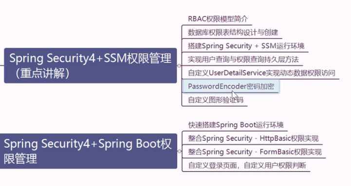

# SpringSecurity4教程

[B站视频地址](https://www.bilibili.com/video/av51809660)

[github示例代码](https://github.com/liutaob/studySpringSecurity)

~~由于B站up主未提供资料，个人整理,主要看代码理解~~

## 一、SpringSecurity入门开发

[官网](https://spring.io/projects/spring-security)

**思维导图**

### 1.SpringSecurity框架简介

### 2.security和shiro对比

 
 

### 3.搭建工程

### 4.HttpBasic方式的权限实现

### 5.FormLogin方式的权限实现

###6.执行原理分析

进入springmvc之前原理过滤器链里各种过滤器 断点测试

### 7.自定义登录页面、登录请求

认证内存硬编码、自定义数据UserDetailService查数据库账户和角色、跨站处理、自定义错误、前后端分离异步客户端错误处理

## 二、SpringSecurity+SSM权限管理

### 1.数据库设计

[数据库sql文件](sql.md)

###2.搭建SSM+Security

ssm+过滤器链即可

### 3.Dao层使用逆向工程

不支持多表，用桥表模拟

### 4.查数据库方式认证

封装返回类（必须实现userdetail接口）、自定义补充userdao、service、配置config（验证码过滤器）

## SpringSecurity+Springboot权限管理

执行流程、代码spring、ssm、springboot、ncore

**遇到的问题：**启动就创建表？